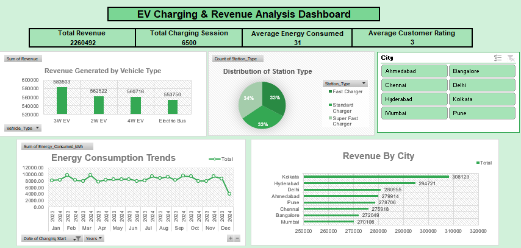

#### 📊 Project Overview

This project analyzes EV charging behavior, revenue generation, station usage and energy consumption using Microsoft Excel. The analysis was performed on **6,500 EV charging sessions**, generating over **2.26M in total revenue** and providing insights into charging trends, customer behavior and operational performance.

The dashboard helps stakeholders understand charging demand, identify high-performing cities and vehicle categories and support data-driven decisions related to infrastructure planning and revenue optimization.

---

#### 🎯 Objectives

* Analyze EV charging data to identify revenue and usage trends.
* Compare charging performance across vehicle categories and cities.
* Evaluate energy consumption behavior over time.
* Assess customer satisfaction using ratings analysis.
* Generate actionable recommendations to improve business performance.
* Present insights through an interactive Excel dashboard.

---

#### 🛠️ Tools & Techniques Used

* Microsoft Excel
* Data Cleaning & Preprocessing
* Pivot Tables & Pivot Charts
* Excel Formulas & Functions
* Conditional Formatting
* Interactive Dashboard Design
* KPI Reporting & Visualization

---

#### 📈 Dashboard Features

##### KPI Metrics

* Total Revenue: **2,260,492**
* Total Charging Sessions: **6,500**
* Average Energy Consumed: **31 kWh**
* Average Customer Rating: **3**

##### Dashboard Analysis

* Revenue by Vehicle Type
* Revenue by City
* Charging Station Type Distribution
* Energy Consumption Trends
* Customer Rating Analysis
* Interactive Filters and Slicers

---

#### 💡 Key Insights

##### 🚗 3W EVs Generated the Highest Revenue

* 3W EVs generated approximately **583K+** in revenue, outperforming all other vehicle categories.
* 2W EVs and 4W EVs generated approximately **562K+** and **561K+** respectively.

**Business Impact:**
Prioritizing charging solutions and service offerings for 3W EV users can support revenue growth and infrastructure utilization.

---

##### ⚡ Balanced Usage Across Charging Station Types

* Fast, Standard and Super Fast charging stations each contributed roughly one-third of total charging activity.
* Fast and Super Fast charging options remained highly utilized due to convenience and reduced charging time.

**Business Impact:**
Expanding high-speed charging infrastructure can improve customer experience and support increasing charging demand.

---

##### 🌆 Kolkata Generated the Highest Revenue

* Kolkata generated approximately **308K+** in revenue, making it the highest-performing city.
* Hyderabad followed with approximately **295K+**, while Pune generated approximately **279K+**.

**Business Impact:**
High-performing cities represent strong opportunities for infrastructure expansion, targeted marketing and customer acquisition.

---

##### 📈 Energy Consumption Fluctuated Throughout the Year

* Energy consumption varied across different periods, reflecting changing charging demand and usage behavior.
* Peak consumption periods indicate opportunities for improved energy planning and operational efficiency.

**Business Impact:**
Monitoring demand patterns can help optimize electricity distribution and station availability.

---

##### ⭐ Customer Ratings Indicate Improvement Opportunities

* The average customer rating was **3/5**, suggesting moderate customer satisfaction levels.
* Service quality and station experience can be further improved to increase retention and loyalty.

**Business Impact:**
Enhancing maintenance, reducing waiting times and improving customer support can strengthen user satisfaction.

---

#### 📌 Recommendations

* Expand charging infrastructure in high-revenue cities such as Kolkata, Hyderabad and Pune.
* Increase investment in Fast and Super Fast charging stations to meet growing customer demand.
* Develop loyalty programs and promotional campaigns to improve customer retention.
* Monitor charging demand patterns to optimize energy distribution and station availability.
* Improve customer experience through better maintenance, cleaner stations and faster issue resolution.
* Focus on 3W EV charging solutions as they represent the highest revenue-generating vehicle segment.

---

#### 📊 Dashboard Preview

The interactive dashboard provides insights into revenue performance, charging behavior, energy consumption trends, station utilization and customer satisfaction through dynamic visualizations and KPI tracking.

---

---

## 📁 Project File
[Download the Excel Project File](EV_Charging_Analysis_Dashboard.xlsx)

---

#### 🚀 Conclusion

This project demonstrates how Microsoft Excel can be used for end-to-end data analysis, KPI reporting and dashboard development. By analyzing 6,500 charging sessions and over 2.26M in revenue, the dashboard uncovered key operational and business insights related to charging behavior, infrastructure utilization and revenue performance, supporting data-driven decision-making within the EV charging ecosystem.
